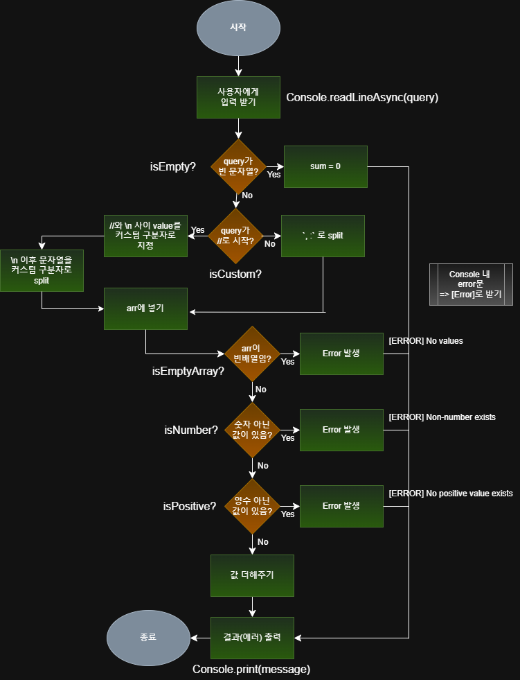

# 프리코스 1주차: 문자열 덧셈 계산기
## 구현 기능 정리


- [x] 1. **입력 받기** by `Console.readLineAsync(query)`
<br/>

- [x] 2. **입력 값 검증**

    - [x] query가 빈 문자열이면? => `sum = 0;` -> 출력
<br/>

- [x] 3. **구분자 설정 및 구분하기**  

    - [x] query 맨 앞이 `//`로 시작하면? -> **커스텀 구분자** 사용
        - [x] 첫 `//`과 `/n` 사이 value를 **커스텀 구분자**로 지정
        - [x] `\n` 이후 문자열을 **커스텀 구분자**로 split
        - [x]  `arr`에 넣기
        ---
    - [x] query 맨 앞이 다른 거로 시작하면? -> `,` `:`가 구분자!
    
        - [x] 구분자로 split
        - [x] `arr`에 넣기
<br/>

- [x] 4. **배열 검증**
   
    - [x] `arr`이 빈 배열이면? => `[Error] No values`
    - [x] `arr`에 숫자 아닌 값이 있으면? => `[Error] Non-number value exists`
    - [x] `arr`에 양수가 아닌 값이 있으면? => `[Error] Non-positive value exists`
<br/>

- [x] 5. **값 더해주기** (`reduce`)
<br/>

- [x] 6. **결과(에러) 출력** by `Console.print(message)`
---

## 테스트
```
npm install
npm run test
npm run start
```
- 실제로 진행하는 **Test case**
1. **커스텀 구분자** 사용하는 case
2. **양수가 아닌** value 있는 case
<br/>

- 추가해볼 **Test case**
- [ ] 정상 case
- [ ] 직접 설정한 Error case
- [ ] Edge case (`Console` 객체 내 throw된 Error)
<br/>


---

## JS style guide
- **상수**
    - **snake_case** 사용   ex) `IS_CUSTOM`

- **식별자**

    - `var` 사용 X. `const/let` 사용
    - `let`은 재할당 필요할 때 사용

- **문자열**

    - `''` 사용
    - 100자가 넘지 않는 문자열은 줄바꿈 하지 않기
    - 문자열 결합 시 `${}`로 감싼 template literal 사용

- **배열**

    - 생성 시 literal 사용 ex) `const arr = [];`
    - 추가 시 `push` 사용
    - 복사 시 `[...]` 스프레드 연산자 사용

- **함수**

    - 소스의 변수명, 클래스명에는 **영문** 이외 사용 X
    - **named function** 사용 ex) `const short = function asd() { ... }`
    - rest 문법 사용 시 argument 대신 `...` 사용 ex) `function concatenateAll(...args) { ... }`

---

## 참고 자료
- [mission-utils 라이브러리 분석 결과](https://quirky-streetcar-a17.notion.site/mission-utils-28c523184d3c80d8904fe0870e5e4181?pvs=74)  
- [Commit convention](https://gist.github.com/stephenparish/9941e89d80e2bc58a153)  
- [JavaScript Style Guide](https://github.com/woowacourse/woowacourse-docs/tree/main/styleguide/javascript)  
- [Airbnb JS Style Guide](https://github.com/airbnb/javascript?tab=readme-ov-file#functions)