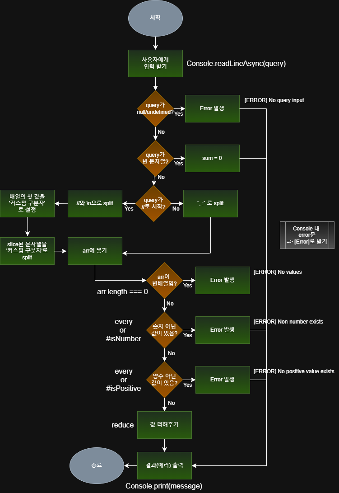

# 프리코스 1주차: 문자열 덧셈 계산기
## 구현 기능 정리


- [ ] 1. **입력 받기** by `Console.readLineAsync(query)`
<br/>

- [ ] 2. **입력 값 검증**

    - [ ] query가 null / undefined면? => `[Error] No query Input` 
    - [ ] query가 빈 문자열이면? => `sum = 0;` -> 출력
<br/>

- [ ] 3. **구분자 설정 및 구분하기**  

    - [ ] query 맨 앞이 `//`로 시작하면? -> **커스텀 구분자** 사용
        - [ ] `//` `/n`으로 split
        - [ ] split된 배열의 첫 value를 **커스텀 구분자**로 지정
        - [ ] 남은 value를 **커스텀 구분자**로 split
        - [ ]  `arr`에 넣기 (`push`)
        ---
    - [ ] query 맨 앞이 다른 거로 시작하면? -> `,` `:`가 구분자!
    
        - [ ] 구분자로 split
        - [ ] `arr`에 넣기 (`push`)
<br/>

- [ ] 4. **배열 검증**
   
    - [ ] `arr`이 빈 배열이면? => `[Error] No values`
    - [ ] `arr`에 숫자 아닌 값이 있으면? => `[Error] Non-number value exists`
    - [ ] `arr`에 양수가 아닌 값이 있으면? => `[Error] Non-positive value exists`
<br/>

- [ ] 5. **값 더해주기** (`reduce`)
<br/>

- [ ] 6. **결과(에러) 출력** by `Console.print(message)`
---

## 테스트
```
npm install
npm run test
npm run start
```
- 실제로 진행하는 **Test case**
1. **커스텀 구분자** 사용하는 case
2. **양수가 아닌** value 있는 case
<br/>

- 추가해볼 **Test case**
- [ ] 정상 case
- [ ] 직접 설정한 Error case
- [ ] Edge case (`Console` 객체 내 throw된 Error)
<br/>


---

## 참고 자료
- [mission-utils 라이브러리 분석 결과](https://quirky-streetcar-a17.notion.site/mission-utils-28c523184d3c80d8904fe0870e5e4181?pvs=74)  
- [Commit convention](https://gist.github.com/stephenparish/9941e89d80e2bc58a153)  
- [JavaScript Style Guide](https://github.com/woowacourse/woowacourse-docs/tree/main/styleguide/javascript)  